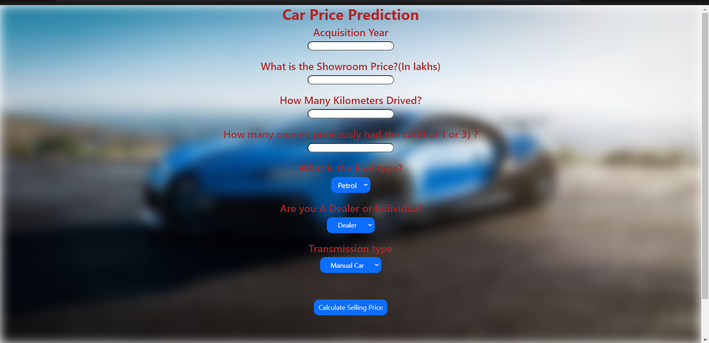

# Car-Price-Prediction
Project Topic: Car Price Prediction  |
Live Link : https://car-price-prediction-sdpw.onrender.com

This data science project aims to develop a car price prediction model based on various features such as the acquisition year, showroom price, kilometers driven, number of previous owners, fuel type, dealer or individual, and transmission type. By utilizing machine learning algorithms and regression techniques, we will create a model that can estimate the selling price of a used car accurately.

The dataset for this project will consist of historical car sale records, including the aforementioned features and their corresponding selling prices. By analyzing this dataset, we will extract meaningful insights and build a predictive model that can generalize and make accurate price predictions for new or unseen car instances.

Data cleaning techniques will be applied to preprocess the dataset, ensuring its quality and removing any inconsistencies or missing values. This step is crucial for maintaining data integrity and improving the accuracy of the predictive model.

Feature engineering will be employed to extract meaningful insights and create new features from the existing dataset. Techniques such as feature scaling, one-hot encoding, and creating derived features may be utilized to enhance the predictive power of the model. These transformations aim to capture relevant patterns and relationships between the input features and the target variable (car price).

The KNN algorithm will be employed as the predictive model for this project. KNN is a supervised machine learning algorithm used for both classification and regression tasks. By finding the nearest neighbors in the feature space, KNN predicts the price of a car based on the similarities of its features to those in the training dataset. The algorithm will be trained on the preprocessed dataset to learn the relationships between the input features and the car prices.

Throughout the project, other fundamental data science concepts, such as exploratory data analysis (EDA), data visualization, and model evaluation techniques, will be applied. EDA will help in understanding the distribution and relationships among the variables, while data visualization will provide meaningful insights into the data. Model evaluation will assess the performance of the predictive model, allowing for fine-tuning and optimization.

By leveraging these data science techniques, this project aims to build a robust car price prediction model that can be used by car dealers, sellers, or individuals to estimate the appropriate price for used cars. The project will contribute to fair pricing in the used car market and assist in making informed decisions based on accurate predictions.

Key Features:

Acquisition Year: The year in which the car was purchased by the current owner. This feature helps capture the effect of depreciation over time on the car's price.

Showroom Price: The original price of the car as listed in the showroom. This feature serves as an indicator of the car's initial value and influences its depreciation rate.

Kilometers Driven: The total distance the car has been driven. This feature reflects the car's usage and impacts its price, as higher mileage generally leads to lower resale value.

Number of Previous Owners: The count of individuals who have previously owned the car. This feature considers the car's ownership history, as cars with more owners may have a lower price due to potential wear and tear.

Fuel Type: The type of fuel used by the car, such as petrol, diesel, or electric. Different fuel types may affect the car's price due to variations in fuel efficiency, availability, and environmental considerations.

Dealer or Individual: Indicates whether the car is being sold by a dealer or an individual owner. This feature may have an impact on the car's price, as dealerships tend to offer additional services and warranties.

Transmission Type: The type of transmission used in the car, such as manual or automatic. The transmission type can influence the car's price, as automatic transmissions generally command a higher price.

By training a machine learning model on this diverse set of features, we aim to create a reliable and accurate car price prediction system. The developed model can be utilized by car dealers, sellers, or individuals interested in estimating the appropriate price for a used car based on its characteristics. This project will enable better decision-making and facilitate fair pricing in the used car market.